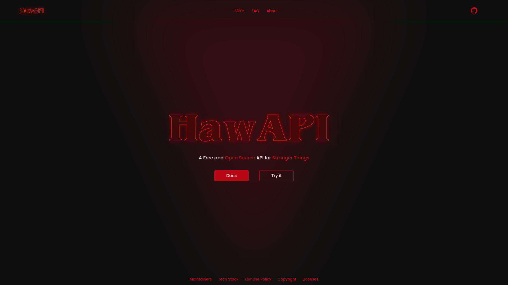
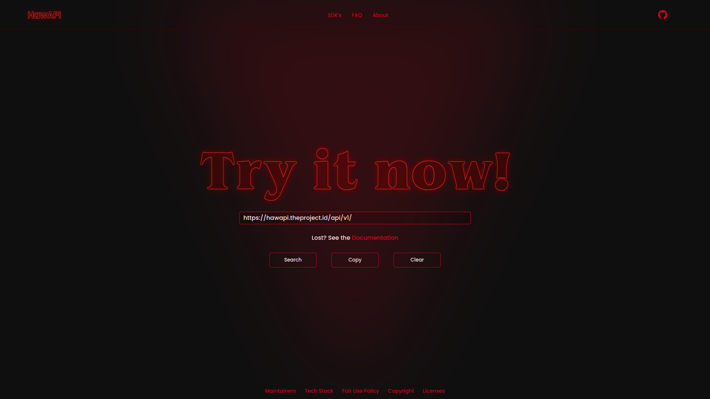

# HawAPI - Website

This repository contains the source code required to build the [HawAPI](https://hawapi.theproject.id) website and documentation.

## Topics

- [Prerequisites](#prerequisites)
- [Dependencies](#dependencies)
- [Setup](#usage)
- [Scripts](#scripts)
- [Preview](#preview)
- [Contributing](#contributing)
- [License](#license)

## Prerequisites

- Text editor or IDE (VsCode, Subline, Noteped++)
- Npm/Yarn
  - [Astro](https://astro.build/) for [website](https://github.com/HawAPI/website) generation
  - [Retype](https://retype.com/) for [docs](https://github.com/HawAPI/website) generation

## Dependencies

- [@astrojs/sitemap](https://www.npmjs.com/package/@astrojs/sitemap)
- [astro](https://www.npmjs.com/package/astro)
- [astro-compress](https://www.npmjs.com/package/astro-compress)
- [eslint](https://www.npmjs.com/package/eslint)
- [prettier](https://www.npmjs.com/package/prettier)

## Setup

Step by step of how to run the application.

> See all [Prerequisites](#prerequisites)

### Clone

> **Note** \
> Alternatively, you could [download all files (Zip)](https://github.com/HawAPI/website/archive/refs/heads/main.zip)

- SSH

```
git clone git@github.com:HawAPI/website.git
```

- HTTPS

```
git clone https://github.com/HawAPI/website.git
```

### Application

```
yarn dev
```

Open the browser and go to:

```
http://localhost:3000
```

## Scripts

All scripts are run from the root of the project, from a terminal:

| Command           | Action                                             |
| :---------------- | :------------------------------------------------- |
| `yarn`            | Installs dependencies                              |
| `yarn dev`        | Starts local dev server at `localhost:3000`        |
| `yarn dev-docs`   | Starts local dev (docs) server at `localhost:5005` |
| `yarn build`      | Build production site to `./build/`                |
| `yarn build-docs` | Build production site (docs) to `./docs/build/`    |
| `yarn build-all`  | Build all production site to `./build/`            |
| `yarn clean`      | Remove `./build/`                                  |

> **Note** \
> See [docs](https://github.com/HawAPI/docs) to check all docs scripts.

## Preview

<details>
<summary>Home</summary>



</details>

<details>
<summary>Try it</summary>



</details>

## Contributing

You could help continuing its development by:

- [Contribute](CONTRIBUTING.md) to the source code
- Suggest new features and report issues

## Contact

For any questions about the project: [Contact](https://github.com/HawAPI/HawAPI#contact).

## Code of conduct

We will behave ourselves if you behave yourselves. For more details see our
[Code of conduct](https://github.com/HawAPI/HawAPI/blob/main/CODE_OF_CONDUCT.md).

## License

HawAPI is licensed under the [MIT License](LICENSE).

> Check out all [licenses/dependencies](https://hawapi.theproject.id/docs/about/#licenses)
